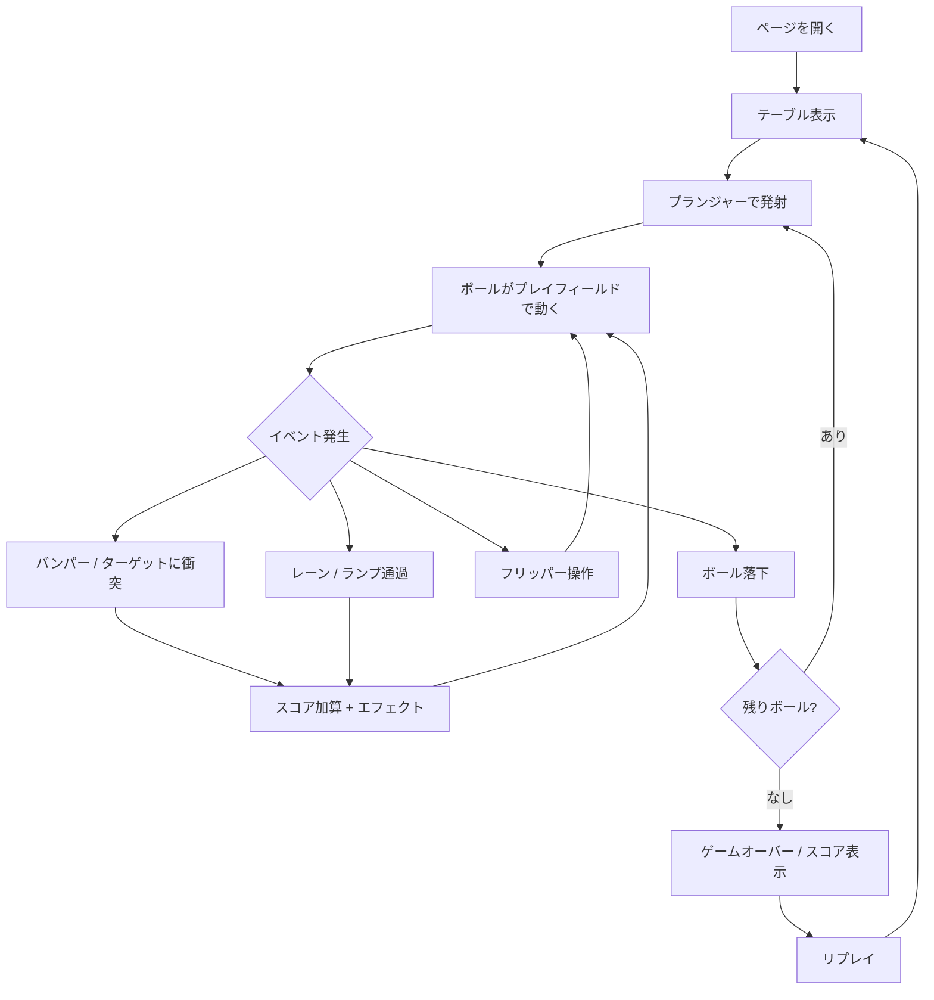

# Web Pinball Game

## Problem Frame

ブラウザ上で遊べるピンボールゲームを新規開発する。Windows 3D Pinball（Space Cadet）のような本格的なピンボール体験をWebで再現し、実際に楽しめるクオリティを目指す。

## User Flow

## Requirements

**コアゲームプレイ**
- R1. 物理ベースのボール挙動（重力、反射、摩擦）をMatter.jsで実装する
- R2. 左右フリッパーをキーボード操作（左右矢印 or Z/X）で制御できる
- R3. プランジャー（ボール発射装置）をスペースキー長押しで力を溜めて発射できる
- R4. 3ボール制でゲームを進行し、全ボール落下でゲームオーバーとする

**テーブル要素**
- R5. バンパー（丸型）を複数配置し、衝突時にボールを弾き返す
- R6. キッカー / スリングショット（フリッパー上の三角形）を左右に配置する
- R7. レーン（ボールの通路）を少なくとも2本配置する
- R8. ドロップターゲット（当てると倒れるターゲット）を1セット以上配置する
- R9. ランプ（傾斜路）を少なくとも1本配置する（技術的に実現困難な場合は、視覚的にランプ風の演出を持つレーンで代替可）

**スコアリング**
- R10. 各テーブル要素への衝突・通過でスコアを加算する
- R11. スコア、残りボール数、現在のボール番号を画面上に常時表示する
- R12. ハイスコアをローカルストレージに保存し、ゲームオーバー画面で表示する

**マルチボール（ストレッチゴール）**
- R13. 全ドロップターゲット（R8）を撃破するとマルチボール（2ボール同時プレイ）を発動する。コアゲームプレイ完成後に実装する

**ビジュアル・演出**
- R14. Windows 3D Pinball（Space Cadet）を参考にした擬似3D風のメタリックなビジュアルスタイルにする
- R15. バンパー衝突時やスコア獲得時に視覚エフェクト（発光、フラッシュ等）を表示する
- R16. 効果音を各アクション（フリッパー、バンパー、発射、スコア）に付ける

**UI**
- R17. タイトル画面とゲームオーバー画面をReactコンポーネントで実装する
- R18. ゲーム画面はCanvas要素で描画し、ReactでUI（スコア表示等）をオーバーレイする

## Success Criteria

- ブラウザでページを開いてすぐにピンボールを遊べる
- フリッパー操作が直感的でレスポンシブ（入力遅延を感じない）
- ボールの物理挙動が自然で、ピンボールらしい動きをする
- 3分以上繰り返し遊びたくなる面白さがある

## Scope Boundaries

- モバイル対応は初期スコープ外（PC ブラウザのみ）
- マルチプレイヤー機能は含まない
- テーブルは1面のみ（複数テーブルは将来拡張）
- サーバーサイドのスコアランキングは含まない（ローカル保存のみ）
- チルト（台揺らし）機能は初期スコープ外

## Key Decisions

- **React + Canvas**: UIはReactで管理し、ゲーム描画はCanvas 2Dで行う。ReactがUI状態管理、Canvasがリアルタイムレンダリングを担当する分離構成。
- **Matter.js**: 物理エンジンにMatter.jsを採用。ピンボールに必要な衝突判定・重力・反発を既存ライブラリに任せ、開発速度を優先する。
- **Space Cadet風ビジュアル**: グラデーション、シャドウ、メタリックな色合いを使ってCanvas 2D上で擬似3Dの見た目を再現する。

## Dependencies / Assumptions

- Matter.jsを物理エンジンとして使用する。高速衝突のトンネリング問題が発生した場合は、CCD（連続衝突検出）やサブステップ等で対処する（詳細はプランニングで調査）
- 効果音はWeb Audio APIまたは軽量ライブラリで実装（具体的な選定はプランニングで決定）

## Outstanding Questions

### Deferred to Planning

- [Affects R14][Needs research] Canvas 2DでSpace Cadet風の擬似3Dビジュアルをどこまで再現できるか、技術的な限界と代替手法の調査
- [Affects R1][Technical] Matter.jsのフリッパーヒンジ設定の最適パラメータと、高速ボールのトンネリング（貫通）防止策
- [Affects R9][Technical] ランプ（高低差のある経路）を2D物理エンジンでどう表現するか
- [Affects R16][Needs research] 効果音ライブラリの選定（Web Audio API直接 vs Howler.js等）

## Next Steps

-> `/ce:plan` for structured implementation planning
