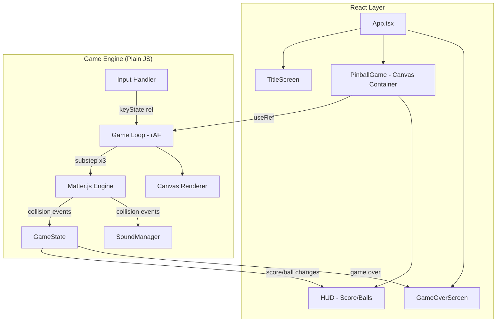

# feat: Web Pinball Game

## Overview

ブラウザ上で遊べるピンボールゲームを新規開発する。React + Canvas 2D + Matter.js を使用し、Windows 3D Pinball（Space Cadet）風の擬似3Dビジュアルで本格的なピンボール体験を提供する。

## Problem Frame

Windows 3D Pinball のようなピンボール体験をWebブラウザで再現する。フリッパー操作のレスポンシブさ、物理挙動の自然さ、繰り返し遊びたくなる面白さを重視する。（see origin: `docs/brainstorms/2026-05-08-web-pinball-game-requirements.md`）

## Requirements Trace

- R1. 物理ベースのボール挙動（重力、反射、摩擦）をMatter.jsで実装する
- R2. 左右フリッパーをキーボード操作（左右矢印 or Z/X）で制御できる
- R3. プランジャーをスペースキー長押しで力を溜めて発射できる
- R4. 3ボール制でゲームを進行し、全ボール落下でゲームオーバー
- R5. バンパー（丸型）を複数配置し、衝突時にボールを弾き返す
- R6. スリングショット（フリッパー上の三角形）を左右に配置
- R7. レーンを少なくとも2本配置
- R8. ドロップターゲットを1セット以上配置
- R9. ランプを少なくとも1本配置（実現困難な場合はランプ風レーンで代替可）
- R10. 各テーブル要素への衝突・通過でスコアを加算
- R11. スコア、残りボール数、現在のボール番号を常時表示
- R12. ハイスコアをlocalStorageに保存しゲームオーバー画面で表示
- R13. 全ドロップターゲット撃破でマルチボール発動（ストレッチゴール）
- R14. Space Cadet風の擬似3Dメタリックビジュアル
- R15. 衝突時・スコア獲得時の視覚エフェクト
- R16. 各アクションに効果音
- R17. タイトル画面とゲームオーバー画面をReactコンポーネントで実装
- R18. ゲーム描画はCanvas、ReactでUIオーバーレイ

## Scope Boundaries

- PCブラウザのみ（モバイル対応はスコープ外）
- マルチプレイヤー機能なし
- テーブルは1面のみ
- サーバーサイドのスコアランキングなし（localStorage保存のみ）
- チルト機能なし

## Context & Research

### 技術調査結果

**Matter.js フリッパー実装:**
- `Bodies.trapezoid` で台形ボディを作成し、ゼロ長 `Constraint` をヒンジ（回転軸）として使用
- `Body.setAngularVelocity` でフリッパー回転を制御
- `beforeUpdate` イベントで角度をクランプ（Matter.jsには角度制限がないため手動制御が必要）

**トンネリング（貫通）防止:**
- サブステップが最も効果的 — `Engine.update(engine, delta/3)` を3回呼び出し
- `positionIterations: 15`, `velocityIterations: 8` に増加（positionIterationsの増加はConstraintの安定性も向上させる）
- 壁の衝突ボディをボール半径の2倍以上の厚さに
- `beforeUpdate` でボール速度に上限を設定（~20 units）

**ランプのシミュレーション:**
- 衝突フィルターによるレイヤー切り替え方式を採用
- `TABLE`レイヤーと`RAMP`レイヤーを`collisionFilter.category`で分離
- ランプ入口センサーでボールのレイヤーを切り替え、出口センサーで戻す
- ビジュアル面ではボールを縮小表示＋影オフセットで高さを表現

**React + Canvas 構成:**
- Canvasは`useRef`経由で取得、ゲームエンジンを`useEffect`で初期化
- ゲーム状態（物理エンジン、スコア、ボール数）はReact外のプレーンJSで管理
- スコア変更時のみReact stateに通知（60fpsで毎フレームsetStateしない）
- キー入力は`useEffect`内でlistener登録、mutable refに保存

**効果音:**
- Web Audio API を直接使用（Howler.js不要 — 4-6個の短い効果音には過剰）
- `AudioContext` + `AudioBuffer` + `AudioBufferSourceNode` パターン
- ユーザージェスチャーでの`AudioContext.resume()`が必要

### External References

- Matter.js公式ドキュメント — Constraint, Body, Engine, Events API
- Web Audio API — MDN

## Key Technical Decisions

- **自前ゲームループ**: `Matter.Runner`ではなく`requestAnimationFrame`で自前ループを構築。サブステップ制御とレンダリング順序を完全にコントロールする
- **ゲーム状態のReact外管理**: 物理エンジン状態やスコアはプレーンJSクラスで管理し、UIに関わる変更時のみReact stateにブリッジ。60fpsでのsetState回避
- **サブステップ物理**: 1フレームあたり3回のEngine.updateでトンネリングを防止
- **レイヤー切り替えランプ**: 衝突フィルターのcategory/maskでテーブル層とランプ層を分離
- **Web Audio API直接使用**: 少数の効果音にはライブラリ不要。30-50行のSoundManagerで十分

## Open Questions

### Resolved During Planning

- **フリッパーヒンジの実現方法**: ゼロ長Constraintでヒンジを再現し、beforeUpdateで角度クランプ
- **トンネリング防止策**: サブステップ(3分割) + 高iterations + 壁厚化 + 速度上限の組み合わせ
- **ランプの2D表現**: 衝突フィルターレイヤー切り替え + 視覚的な縮小表示で高さを演出
- **効果音ライブラリ選定**: Web Audio API直接使用（Howler.jsは4-6音には過剰）

### Deferred to Implementation

- **テーブルレイアウトの座標値**: バンパー・レーン等の最適な配置座標は、実際に動かしながら調整
- **各要素のスコア配点**: バンパー100点、ターゲット500点等の具体的な配点はプレイテストで調整
- **Space Cadetビジュアルの再現度**: Canvas 2Dグラデーション・シャドウで可能な範囲を実装しながら判断
- **Matter.jsの具体的なパラメータ値**: density, restitution, friction等の最適値は実行時に調整

## Output Structure

```
src/
  main.tsx
  App.tsx
  components/
    TitleScreen.tsx
    GameOverScreen.tsx
    HUD.tsx
    PinballGame.tsx
  game/
    engine.ts
    gameLoop.ts
    renderer.ts
    input.ts
    flipper.ts
    plunger.ts
    ball.ts
    table.ts
    scoring.ts
    gameState.ts
    soundManager.ts
    types.ts
  assets/
    sounds/
index.html
package.json
vite.config.ts
tsconfig.json
```

## High-Level Technical Design

> *This illustrates the intended approach and is directional guidance for review, not implementation specification. The implementing agent should treat it as context, not code to reproduce.*



**データフロー:**
1. `PinballGame`コンポーネントがマウント時にCanvasRefでゲームループを初期化
2. ゲームループが毎フレーム: 入力読み取り → フリッパー角速度設定 → 物理サブステップx3 → Canvas描画
3. 物理エンジンの衝突イベントでスコア加算・効果音再生
4. `GameState`のスコア/ボール数変更時のみReactコールバックでHUDを更新
5. ゲームオーバー時にReact stateを切り替えてGameOverScreenを表示

## Implementation Units

- [ ] **Unit 1: プロジェクトセットアップ & 基本ゲームループ**

**Goal:** Vite + React + TypeScript プロジェクトを構築し、Matter.js物理エンジンとCanvasレンダリングの基本ループを動作させる。ボールが重力で落下し、壁に反射する最小限のデモ。

**Requirements:** R1, R18

**Dependencies:** なし

**Files:**
- Create: `package.json`, `vite.config.ts`, `tsconfig.json`, `index.html`
- Create: `src/main.tsx`, `src/App.tsx`
- Create: `src/components/PinballGame.tsx`
- Create: `src/game/engine.ts`, `src/game/gameLoop.ts`, `src/game/renderer.ts`, `src/game/ball.ts`, `src/game/types.ts`
- Test: `src/game/__tests__/engine.test.ts`

**Approach:**
- Vite + React + TypeScript でプロジェクト初期化、matter-js をインストール
- `engine.ts` でMatter.js Engineを生成（positionIterations: 15, velocityIterations: 8）
- `gameLoop.ts` で `requestAnimationFrame` ベースのループを構築、サブステップ3分割
- `renderer.ts` で Canvas 2D コンテキストを使った最小限のレンダリング（ボールは円、壁は矩形）
- `PinballGame.tsx` で canvasRef を取得し、useEffect でゲームループを起動・クリーンアップ
- テーブル外枠の壁は静的ボディで配置。壁のコリジョンボディはボール半径の2倍以上の厚さ
- ボール速度上限を `beforeUpdate` イベントで設定
- ボールは最初から配列（`balls: Body[]`）で管理する。Units 1-5では1ボールのみ使用するが、Unit 8（マルチボール）での拡張に備えた設計

**Patterns to follow:**
- ゲーム状態はReact外で管理（プレーンJSオブジェクト）
- Matter.Render は使用しない（自前レンダラー）

**Test scenarios:**
- Happy path: エンジン生成時にpositionIterations=15, velocityIterations=8が設定されること
- Happy path: ボールが配列で管理されていること（マルチボール対応の基盤）
- Happy path: ゲームループ開始でrAFが呼ばれ、Engine.updateがサブステップ回数分呼ばれること
- Edge case: delta上限（33ms）を超えるフレームでも物理が安定すること
- Edge case: コンポーネントアンマウント時にゲームループとエンジンが正しくクリーンアップされること

**Verification:**
- ブラウザでページを開くとCanvasが表示され、ボールが重力で落下して壁に反射する

---

- [ ] **Unit 2: フリッパー & キーボード入力**

**Goal:** 左右フリッパーをキーボードで操作でき、ボールを打ち返せるようにする。

**Requirements:** R2

**Dependencies:** Unit 1

**Files:**
- Create: `src/game/flipper.ts`, `src/game/input.ts`
- Modify: `src/game/engine.ts`, `src/game/renderer.ts`, `src/game/gameLoop.ts`
- Test: `src/game/__tests__/flipper.test.ts`, `src/game/__tests__/input.test.ts`

**Approach:**
- `flipper.ts`: 台形ボディ + ゼロ長Constraintでヒンジを作成。左右各1つ
- `input.ts`: `keydown`/`keyup` リスナーをmutable ref（またはプレーンオブジェクト）で管理。左矢印/Zキーで左フリッパー、右矢印/Xキーで右フリッパー
- ゲームループの各フレームで入力状態を読み取り、`Body.setAngularVelocity` でフリッパーを回転
- `beforeUpdate` イベントでフリッパー角度をクランプ（上限・下限角度を設定）
- キーリリース時は小さな逆方向の角速度を設定し、重力で自然に戻るようにする

**Patterns to follow:**
- キー入力はReact stateではなくmutable refで管理（60fpsでのsetState回避）

**Test scenarios:**
- Happy path: フリッパー生成時にConstraintがゼロ長で設定されること
- Happy path: キー押下時にフリッパーの角速度が設定されること
- Happy path: キーリリース時にフリッパーが元の角度に戻ること
- Edge case: 角度クランプが上限・下限の両方で機能すること
- Edge case: 左右同時押しで両フリッパーが独立して動作すること
- Integration: フリッパー回転中にボールが衝突すると弾き返されること

**Verification:**
- 左右矢印キーでフリッパーが上下に動き、ボールを打ち返せる

---

- [ ] **Unit 3: プランジャー & ボールライフサイクル**

**Goal:** スペースキー長押しでボールを発射でき、3ボール制のゲーム進行とドレイン検出を実装する。

**Requirements:** R3, R4

**Dependencies:** Unit 2

**Files:**
- Create: `src/game/plunger.ts`, `src/game/gameState.ts`
- Modify: `src/game/engine.ts`, `src/game/renderer.ts`, `src/game/gameLoop.ts`, `src/game/input.ts`
- Test: `src/game/__tests__/plunger.test.ts`, `src/game/__tests__/gameState.test.ts`

**Approach:**
- `plunger.ts`: スペースキー長押し中にチャージ量を増加（最大値あり）。キーリリースでチャージ量に比例した力をボールに適用
- プランジャーの位置はテーブル右下の発射レーン内
- ドレイン検出: フリッパー下のセンサーボディ（`isSensor: true`）でボール落下を検出
- `gameState.ts`: ゲーム状態管理（現在のフェーズ: title/playing/gameOver、残りボール数、現在のボール番号）。ボール配列を管理
- ボール落下時: 残りボールがあれば新ボールをプランジャー位置に生成、なければゲームオーバー。（注: Unit 8マルチボール時はドレイン動作が変更される）
- ゲームオーバー時にReactコールバックを呼び出してUI切り替え

**Patterns to follow:**
- ゲーム状態変更時のみReactにコールバック通知

**Test scenarios:**
- Happy path: スペースキー長押しでチャージ量が増加し、最大値でキャップされること
- Happy path: キーリリースでチャージ量に比例した速度でボールが発射されること
- Happy path: ボールがドレインセンサーに触れると残りボール数が減少すること
- Happy path: 残りボール>0の時、ドレイン後に新ボールがプランジャー位置に生成されること
- Edge case: 最後のボール（3球目）のドレインでゲームオーバー状態に遷移すること
- Edge case: プレイ中（ボールが場上にある時）のスペースキーは無視されること

**Verification:**
- スペースキー長押し→リリースでボールが発射され、3回落下するとゲームが終了する

---

- [ ] **Unit 4: テーブル要素**

**Goal:** バンパー、スリングショット、レーン、ドロップターゲット、ランプを配置し、完全なピンボールテーブルを構成する。

**Requirements:** R5, R6, R7, R8, R9

**Dependencies:** Unit 3

**Files:**
- Create: `src/game/table.ts`
- Modify: `src/game/engine.ts`, `src/game/renderer.ts`, `src/game/types.ts`
- Test: `src/game/__tests__/table.test.ts`

**Approach:**
- **バンパー（R5）**: 静的円ボディ。collisionStartイベントで`Body.applyForce`を適用してアクティブな弾き返し（restitutionだけでは不十分なため、力の直接適用が主な弾き返し手段）
- **スリングショット（R6）**: 静的三角形ポリゴン + 前方にセンサーゾーン。センサー衝突時に法線方向へ力を適用
- **レーン（R7）**: 静的矩形/頂点で構成したガイドレール。`friction: 0.05`, `restitution: 0.3`。左側と右側に各1本以上
- **ドロップターゲット（R8）**: 小さな静的矩形。衝突検出後、次フレームのafterUpdateまたはゲームループ冒頭でワールドから除去（collisionStart内での直接除去はMatter.jsの衝突処理を不安定にするため回避）。ゲーム状態で撃破状況を追跡。ボールドレイン時に復元
- **ランプ（R9）**: 衝突フィルターレイヤー切り替え方式。`TABLE(0x0001)` と `RAMP(0x0002)` レイヤーを定義。入口センサーでボールのcollisionFilter.categoryをRAMPに切り替え、出口で戻す。ランプ壁はRAMPレイヤーのみとコリジョン
- テーブルレイアウトの座標値はハードコードし、プレイテストで調整

**Patterns to follow:**
- Matter.js `Events.on(engine, 'collisionStart', ...)` で各要素の衝突を検出
- 要素タイプ識別用にボディの `label` プロパティを活用

**Test scenarios:**
- Happy path: バンパー衝突時にボールが弾き返される（反発力が適用される）こと
- Happy path: ドロップターゲット衝突時にターゲットがワールドから除去されること
- Happy path: ランプ入口センサー通過でボールのcollisionFilterがRAMPレイヤーに切り替わること
- Happy path: ランプ出口センサー通過でボールがTABLEレイヤーに戻ること
- Edge case: ドロップターゲット全滅後のボールドレインでターゲットが全復元されること
- Edge case: ランプ上のボールがテーブル層の壁と衝突しないこと
- Integration: スリングショットのセンサーゾーンとボールの衝突で正しい方向に力が適用されること

**Verification:**
- テーブル上に全要素が表示され、ボールが各要素と正しく相互作用する

---

- [ ] **Unit 5: スコアリング & React UI**

**Goal:** 衝突ベースのスコアシステムとReact UIレイヤー（タイトル画面、HUD、ゲームオーバー画面）を統合する。

**Requirements:** R10, R11, R12, R17, R18

**Dependencies:** Unit 4

**Files:**
- Create: `src/game/scoring.ts`
- Create: `src/components/TitleScreen.tsx`, `src/components/GameOverScreen.tsx`, `src/components/HUD.tsx`
- Modify: `src/App.tsx`, `src/components/PinballGame.tsx`, `src/game/gameState.ts`
- Test: `src/game/__tests__/scoring.test.ts`, `src/components/__tests__/GameOverScreen.test.ts`

**Approach:**
- `scoring.ts`: collisionStartイベントで衝突した要素のlabelに基づきスコアを加算。要素別の配点マップを定義（具体的な点数はプレイテストで調整）
- `HUD.tsx`: スコア、残りボール数、現在のボール番号を表示。Canvasの上にabsolute positionでオーバーレイ。GameStateからのコールバックで更新
- `TitleScreen.tsx`: ゲームタイトルとスタートボタン。キー押下またはクリックでゲーム開始
- `GameOverScreen.tsx`: 最終スコア、ハイスコア（localStorage）、リプレイボタンを表示
- `App.tsx`: ゲームフェーズ（title/playing/gameOver）に応じて表示コンポーネントを切り替え
- ハイスコアは `localStorage.getItem/setItem` でシンプルに保存

**Patterns to follow:**
- ゲームループからReactへの通知はコールバック関数経由（イベントエミッター等は不要）
- スコア変更は衝突イベント発生時のみ（毎フレームではない）

**Test scenarios:**
- Happy path: バンパー衝突時にスコアが加算されること
- Happy path: ドロップターゲット衝突時にバンパーより高いスコアが加算されること
- Happy path: ゲームオーバー時にスコアがハイスコアを超えていればlocalStorageが更新されること
- Happy path: ゲームオーバー画面にハイスコアと今回のスコアが表示されること
- Edge case: localStorageにハイスコアが存在しない初回プレイで正しく動作すること
- Edge case: リプレイ時にスコアと残りボール数がリセットされること
- Integration: ゲーム状態遷移（title→playing→gameOver→title）が正しく動作すること

**Verification:**
- タイトル画面→ゲームプレイ→ゲームオーバー→リプレイの一連のフローが動作し、スコアが正しく表示・保存される

---

- [ ] **Unit 6: Space Cadet風ビジュアル**

**Goal:** Canvas 2Dのグラデーション・シャドウ・メタリック表現を使い、Space Cadet風の擬似3D的な見た目を実現する。

**Requirements:** R14, R15

**Dependencies:** Unit 5

**Files:**
- Modify: `src/game/renderer.ts`
- Test: なし（ビジュアル変更のため目視確認）

**Approach:**
- **テーブル背景**: 暗い青〜紫のグラデーションでSpace Cadetの雰囲気を再現
- **バンパー**: 放射状グラデーション（中心が明るい）でメタリックな球体感。衝突時にshadowBlurでグロー発光エフェクト
- **フリッパー**: 線形グラデーション（銀〜グレー）でメタリックな質感。角度に応じたハイライト
- **壁・レール**: 線形グラデーション + ドロップシャドウで立体感
- **ボール**: 放射状グラデーション（白ハイライト→銀→ダークグレー）で金属球を表現
- **衝突エフェクト（R15）**: 衝突時に一時的な発光リング（shadowBlur + 半透明円の描画）。フレーム経過で減衰
- **スコアポップアップ**: スコア加算時に加算値を衝突位置にフロートテキストで表示、上方に移動しながらフェードアウト
- **ランプ上のボール**: 少し縮小＋下方向の影オフセットで高さを視覚的に表現

**Test expectation:** none — ビジュアル変更のため、目視による確認のみ

**Verification:**
- テーブル全体がSpace Cadet風のメタリックな見た目になり、衝突時に発光エフェクトが表示される

---

- [ ] **Unit 7: 効果音**

**Goal:** Web Audio APIで効果音マネージャーを実装し、各ゲームアクションに効果音を付ける。

**Requirements:** R16

**Dependencies:** Unit 5

**Files:**
- Create: `src/game/soundManager.ts`
- Create: `src/assets/sounds/` ディレクトリに効果音ファイル（フリッパー、バンパー、発射、スコア、ドレイン）
- Modify: `src/game/gameLoop.ts`（衝突イベントでサウンド再生を呼び出し）
- Test: `src/game/__tests__/soundManager.test.ts`

**Approach:**
- `soundManager.ts`: `AudioContext` を作成し、初回ユーザージェスチャーで `resume()` を呼ぶ
- `preload` 関数: fetch → arrayBuffer → `decodeAudioData` で各音源を `AudioBuffer` に変換
- `play` 関数: `AudioBufferSourceNode` を生成 → `connect(destination)` → `start(0)` で再生。同一音の同時再生に対応（毎回新しいSourceNodeを生成）
- 効果音はWeb Audio APIのOscillatorNodeで合成音を生成する方式を主とする（外部音声ファイル不要）。フリッパーはクリック音（短いパルス波）、バンパーは弾ける音（周波数スイープ）等をプログラマティックに生成。品質が不十分な場合はフリー素材の.mp3ファイルにフォールバック
- 効果音のタイミング: collisionStartイベントと連動（スコアリングと同じイベントフック）
- タイトル画面でのクリック/キー押下時に`AudioContext.resume()`を呼び、ブラウザのautoplay制限を解除

**Patterns to follow:**
- AudioBufferSourceNodeは使い捨て（再利用不可のため毎回生成）

**Test scenarios:**
- Happy path: preload完了後にplay呼び出しでエラーが発生しないこと
- Happy path: 同一音を連続再生しても各再生が独立して動作すること
- Edge case: AudioContextがsuspended状態でもplay呼び出しでエラーにならないこと（resume待ちキュー or 無音再生）
- Edge case: 存在しない音声キーでplayを呼んでもエラーにならないこと

**Verification:**
- フリッパー操作、バンパー衝突、ボール発射、スコア加算時にそれぞれ異なる効果音が鳴る

---

- [ ] **Unit 8: マルチボール（ストレッチゴール）**

**Goal:** 全ドロップターゲット撃破時にマルチボール（2ボール同時プレイ）を発動する。

**Requirements:** R13

**Dependencies:** Unit 5（Unit 4のドロップターゲット実装が前提）

**Files:**
- Modify: `src/game/gameState.ts`, `src/game/engine.ts`, `src/game/scoring.ts`, `src/game/renderer.ts`
- Test: `src/game/__tests__/gameState.test.ts`（マルチボール関連テスト追加）

**Approach:**
- ドロップターゲットの撃破状況を `gameState` で追跡。全滅時にマルチボールフラグをセット
- マルチボール発動時: 2つ目のボールをプレイフィールド上部から投入（ボール配列に追加）
- ドレイン判定の変更: マルチボール中は最後の1つのボールが落下するまでボール消費しない（Unit 3のドレイン動作をオーバーライド）
- 全ボール落下時にマルチボール解除、通常のボール消費に戻る
- ボールは既に配列管理されているため（Unit 1で設計済み）、配列への追加・除去のみで対応

**Execution note:** コアゲームプレイが安定してから着手する。

**Test scenarios:**
- Happy path: 全ドロップターゲット撃破でマルチボールが発動し、2つ目のボールが追加されること
- Happy path: マルチボール中、1つのボールがドレインしても残りのボールでプレイ継続できること
- Edge case: マルチボール中に全ボールが同時にドレインした場合の処理が正しいこと
- Edge case: マルチボール発動中にドロップターゲットが復元されないこと

**Verification:**
- ドロップターゲットを全て倒すと2つ目のボールが出現し、2ボール同時にプレイできる

## System-Wide Impact

- **Interaction graph:** Matter.jsの`collisionStart`イベントが中心ハブ。スコアリング、効果音、エフェクト、ドロップターゲット撃破、ランプ切り替え、ドレイン検出が全てこのイベントから分岐する。各リスナーはtry-catchで隔離し、1つのリスナーのエラーが他に波及しないようにする
- **Error propagation:** AudioContextの初期化失敗は無音で継続（ゲームプレイに影響させない）。localStorageのアクセス失敗はハイスコア機能のみ無効化。collisionStartリスナー内のエラーはキャッチしてログのみ出力
- **State lifecycle risks:** マルチボール発動中のボール数管理。ドロップターゲット復元タイミング（ドレイン時）
- **Unchanged invariants:** Matter.jsの物理シミュレーション自体はカスタマイズしない（パラメータ調整のみ）

## Risks & Dependencies

| Risk | Mitigation |
|------|------------|
| Matter.jsのフリッパーヒンジが不安定になる可能性 | Constraintのstiffnessを0.7-0.9で調整。最悪の場合はConstraintを使わず角度を直接制御する方式に切り替え |
| 高速ボールのトンネリング | サブステップ3分割 + iterations増加 + 壁厚化 + 速度上限の4重防止策 |
| Canvas 2DでのSpace Cadet風ビジュアルの再現限度 | グラデーション・シャドウで可能な範囲に留め、過度なリアリティを追求しない |
| 効果音ファイルの調達 | Web Audio APIのオシレーターで合成音を生成する代替策あり |
| テーブルレイアウトのゲームバランス | 実装後のプレイテストで配置・配点を反復調整 |

## Sources & References

- **Origin document:** [docs/brainstorms/2026-05-08-web-pinball-game-requirements.md](docs/brainstorms/2026-05-08-web-pinball-game-requirements.md)
- Matter.js Docs: Body, Constraint, Engine, Events, World API
- Web Audio API: MDN AudioContext, AudioBufferSourceNode
- Windows 3D Pinball (Space Cadet): ビジュアルリファレンス
